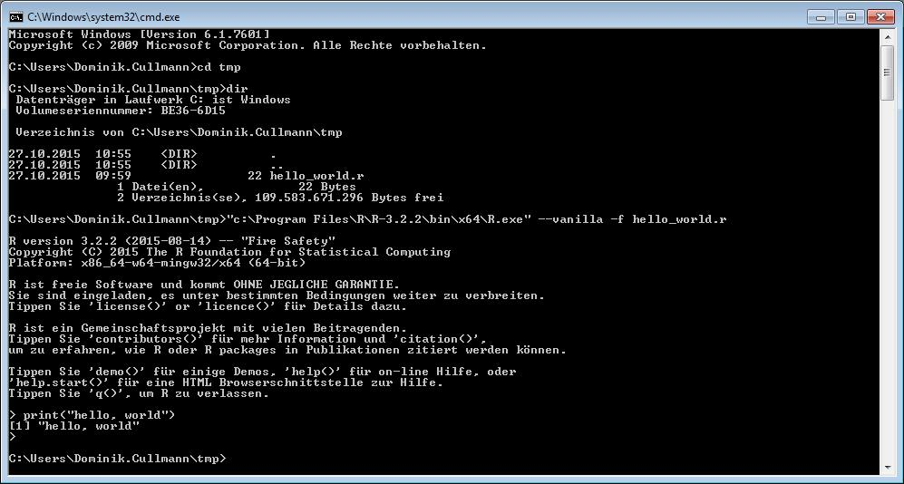
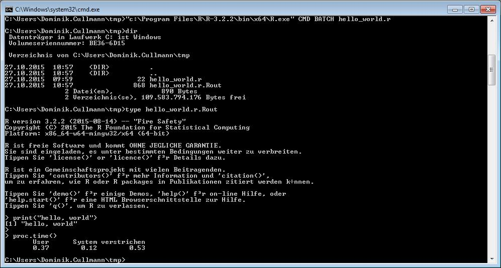
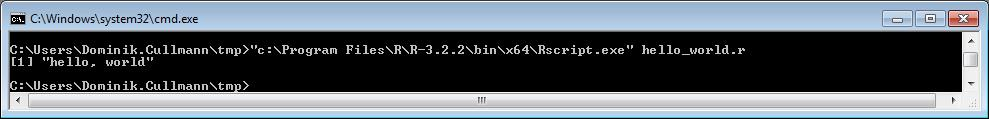

``` {r, echo = FALSE}
#!/usr/bin/Rscript --vanilla
``` 
# Vorweg
## Du 
... bist mir derzeit unbekannt. 
Aber ich gehe davon aus, dass Du 

* **R** nicht oder fast nicht kennst.  
  Sollte dem nicht so sein: suche Dir eine 
  [sinnvollere Lekt&uuml;re](http://d-nb.info/881127515).
* nicht oder fast nicht programmieren kannst.  
  Sollte dem nicht so sein, werden Dir einige meiner Ausf&uuml;hrungen bekannt
  vorkommen.
* vor einem Standard-Arbeitsplatz-Desktop an der 
  Forstlichen Versuchs- und Forschungsanstalt Baden-W&uuml;rttemberg
  sitzt.  
  Sollte dem nicht so sein: Du wirst den meisten Links in diesem Dokument nicht
  folgen k&ouml;nnen, sie verweisen auf einen internen Server an der 
  Forstlichen Versuchs- und Forschungsanstalt Baden-W&uuml;rttemberg.
  [Im Anhang](#anhang) findest Du aber immerhin die Daten aus den Beispielen
  dieses Dokumentes.


## **R** 
... ist

- ``nicht`` eines der potentiellen Konkurrenzprodukte:  
  [SAS](http://www.sas.com), 
  [SPSS](http://www-01.ibm.com/software/analytics/spss/), 
  ein [Geographisches Informationssystem](https://de.wikipedia.org/wiki/Geoinformationssystem),
  [pyData](http://pydata.org/), 
  [Julia](http://julialang.org/).
- eigentlich [GNU R](http://www.r-project.org), ich nenne es aber einfach nur 
  **R**.
- ein Datenanalysetool zur Erstellung von Graphiken, Karten,
  Statistiken und Modellen.
- Der [Interpreter](https://de.wikipedia.org/wiki/Interpreter) f&uuml;r:
- eine [(interpretierte) Programmiersprache](https://en.wikipedia.org/wiki/Interpreted_language):
``` {r}
<#include "src/hello_world.r">
```

Der letzte Punkt ist meiner Meinung der wichtigste, denn: 

## Diese Einführung 
... soll Dir **R** als eine Programmiersprache nahebringen. 
Du wirst **R** hinterher nicht beherrschen. 
Aber vielleicht Lust bekommen haben, es n&auml;her kennenzulernen.

Nicht kennenlernen wirst Du in dieser Einführung **R** als Datenanalysetool,
insbesondere lernst Du hier nichts &uuml;ber **R** und Statistik. 
Allerdings will ich Dich ein wenig locken und verspreche Dir daher, dass Du 
[am Schlu&szlig;](#von-daten-zur-graphik) sch&ouml;ne Bilder machen kannst.

### Darstellung
Ich habe mich wenig um [HTML](https://en.wikipedia.org/wiki/HTML) und 
[CSS](https://en.wikipedia.org/wiki/Cascading_Style_Sheets) geschert, 
[Firefox](https://www.mozilla.org/en-US/firefox/new/) ergibt bei mir eine
bessere Darstellung als der Internet Explorer. Andere Browser habe ich unter
Windows nicht getestet.

###  **R**-Code und Output
Wie Du unter [bereits](#r-ist) gesehen hast, setze ich in diesem Dokument
Programmcode in leicht hinterlegten K&auml;sten, den interpretierten Output in
nicht hinterlegten  K&auml;sten mit zwei f&uuml;hrenden #. Wobei ich den Output
zuweilen, wo er mir l&auml;nglich oder nicht hilfreich erscheint,
unterdr&uuml;cke.
Ein hinterlegtes Textst&uuml;ck innerhalb einer normalen Textzeile zeigt an, 
dass das Textst&uuml;ck ebenfalls **R**-Code ist, dieser aber nicht dazu gedacht
ist, in der dargestellten Form von Dir ausgef&uuml;hrt zu werden. `print`
beispielsweise ist der Name einer Funktion, die wir [oben](#r)  bereits
benuzt haben, die Eingabe von `print` allein in **R** ist aber nicht sinnvoll, 
die von `print()` erzeugt sogar einen Fehler. 
Dennoch sind beides **R**-Code-St&uuml;cke, weswegen ich sie durch Hinterlegung
kennzeichne.

Da dieses Dokument in 
[rmarkdown](https://cran.r-project.org/web/packages/rmarkdown) geschrieben ist
(Details findest Du [hinten](#dieses-dokument)),
wird der Output tats&auml;chlich durch den **R**-Code erzeugt. 
Den gesamten **R**-Code in diesem Dokument findest Du [hier](index.R), einzelne 
Teile aber auch in [diesen **R**-Codes](src).

### Aufgaben
Du findest eine Reihe von Aufgaben in den ersten vier Kapiteln dieses Dokuments.
Sie sehen so aus:

<div style="background-color:#FFE9E9; border:3px #C4DCFB solid;">
**Aufgabe:**
Schreibe Code, der
``` {r, echo = FALSE}
source("answers/example.r")
``` 
ausgibt.   

[Hier findest Du meine L&ouml;sung.](answers/example.r)
</div>
Versuche, sie zu l&ouml;sen, vergleiche dann Deinen Versuch mit meiner
L&ouml;sung (und schreibe mir, falls Dir Dein Versuch eleganter,
sch&ouml;ner oder verst&auml;ndlicher als meine L&ouml;sung erscheint) und lies
_erst dann_ weiter.


# Grundlagen

## **R** benutzen
Um **R** zu nutzen, brauchst Du einen Interpreter. Den kannst Du &uuml;ber die 
Softwareverteilung des Benutzerservice installieren - wahrscheinlich nach
C:\\Program Files\\R\\R-3.1.2\\bin\\i386 oder so.
In diesem Verzeichnis findest Du R.exe, einen 
[command line interpreter](https://en.wikipedia.org/wiki/List_of_command-line_interpreters) 
und Rgui.exe, eine graphische Nutzeroberfl&auml;che f&uuml;r R.exe. 
In beiden kannst Du **R**-Code schreiben, Rgui.exe bietet Dir rudiment&auml;re
Editor-Funktionen, R.exe nicht.

Beide sind nicht sehr komfortabel, daher benutzen Viele an der FVA 
hauptsächlich [RStudio](https://www.rstudio.com/), eine
[IDE](https://en.wikipedia.org/wiki/Integrated_development_environment), mit 
der Du Code editieren und an den **R**-Interpreter &uuml;bergeben kannst.
Du kannst RStudio ebenfalls &uuml;ber die Softwareverteilung des 
Benutzerservice installieren. 
Aber auch andere Entwicklungsumgebungen oder Editoren sind gut. 


``` {r, echo = FALSE}
## I turn off help. Restore it via
#  options(list(pager = file.path(R.home(), "bin/pager")))
options(list(pager = function(..., header,
                     title = "R Information",
               delete.file = FALSE){
               return(NULL)
               }
               )
               )
``` 
<div style="background-color:#FFE9E9; border:3px #C4DCFB solid;">
**Aufgabe:**
Ver&auml;ndere den [obigen Code](#r) so, dass er 
``` {r, echo = FALSE}
source("answers/hello.r")
``` 
ausgibt.   

[Hier findest Du meine L&ouml;sung.](answers/hello.r)
</div>

### **R** im Batch benutzen
Es gibt auch noch die M&ouml;glichkeit, **R** nicht interaktiv sondern im 
Batch-Modus zu nutzen. Das sehen wir aber erst [sp&auml;ter](#r-im-batch).

## Hilfe finden mit der Hilfefunktion
Die Hilfefunktion h&ouml;rt auf den Namen `help()`, sie hat auch eine Kurzform:
``` {r}
help("help", package = "utils")
?help
``` 
Sie liefert eine Hilfeseite die, je nach Konfiguration Deiner Arbeitsumgebung
und Optionen f&uuml;r die Hilfefunktion, als Text, html oder pdf erscheint. 
Sie kann beispielswiese 
[so](files/r_help.html)
aussehen.
Ich finde die Hinweise in der Rubrik ``See Also:`` oft hilfreich.
Ein gutes Beispiel ist 
``` {r}
help("Syntax", package = "base")
?Syntax
``` 
Hier findest Du eine sehr technische Einf&uuml;hrung in die Syntax von **R** und
Verweise auf (unter anderen) die wichtigen Hilfeseiten 
`help("Comparison", package = "base")`
und
`help("Logic", package = "base")`
, auf denen die Vergleichsoperatoren und die logischen Operatoren beschrieben
werden.

## Zuweisungen
Alle Objekte ([Daten](#datentypen-und-indizierung) und 
[Funktionen](#funktionen))
in **R** werden durch Zuweisungen definiert.
``` {r}
a_number <- 3
``` 
Das ist schon recht technisch, denn in anderen Sprachen werden Objekte
zun&auml;chst definiert (oder zumindest deklariert) und erst dann wird ihnen ein
Wert zugewiesen. Das ist etwas umst&auml;ndlich, aber daf&uuml;r funktioniert
der folgende Code in **R** leider:
``` {r}
a_number <- "this is no number, it's a string!"
``` 
Ich kann also ein Objekt mit einem Objekt eines anderen Typs &uuml;berschreiben.


<!---_(Manche Programmiersprachen verlangen die Deklaration eines
Objektes (mit einem bestimmten Typ), in **R** erfolgt die Deklaration und die
Typbestimmung automatisch aus der ersten Zuweisung.)_
-->

Wie bei der Hilfe gibt es neben der Kurzform (bzw. den 5 verschiedenen
Kurzformen, Genaueres findest Du mit `help("assignOps", package = "base")`)
eine flexiblere, ausf&uuml;hrlichere Variante, die ich aber in "normalen"
**R**-Skripten fast nie verwende:
``` {r}
assign("a_number", 4)
``` 
<div style="background-color:#FFE9E9; border:3px #C4DCFB solid;">
**Aufgabe:**
Weise dem Objekt `my_name` Deinen Namen zu und gebe den Wert des Objektes
aus. Bei mir sieht das Ergebnis dann so
``` {r, echo = FALSE}
source("answers/name.r")
``` 
aus. 

[Hier findest Du meine L&ouml;sung.](answers/name.r)
</div>

## Funktionen 
Funktionen spielen in **R** eine gro&szlig;e Rolle, weitaus die meisten
[Anweisungen](https://de.wikipedia.org/wiki/Anweisung_%28Programmierung%29) in
**R** sind Funktionsaufrufe. 

<div style="background-color:#FFE9E9; border:3px #C4DCFB solid;">
**Aufgabe:**
Die **R**-Funktion `readline()` liest eine Eingabe vom **R**-Prompt.
Lies Dir ihre Hilfeseite durch und schreibe ein Programm, das mich auffordert, 
Deinen Namen zu raten und meine Eingabe einem Objekt des Namens `guess` zuweist.
Dann soll es meine Eingabe drucken.

[Hier findest Du meine L&ouml;sung.](answers/readline.r)
</div>


Eine Liste der in Deiner Umgebung verf&uuml;gbaren
Funktionen erh&auml;ltst Du durch
``` {r, results = "hide"}
for (pos in seq(along = searchpaths())) {
    print(lsf.str(pos))
}
```

Allerdings h&auml;ngt diese Liste von den gerade geladenen [Pakete](#r-packages)
ab.

## Operatoren
Wenn wir zwei Dinge miteinander vergleichen wollen, nutzen wir die
Vergleichsoperatoren, die wir gerade schon durch 
`help("Comparison", package = "base")` kennengelernt haben:
``` {r}
a_number != 4 
``` 
*Es gibt in **R** die Funktionen `identical()` und `all.equal()`, die,
wie `==` auf Gleichheit testen. 
Die Hilfeseite `?Comparison` empfiehlt `identical` (beziehungsweise `!
identical`) f&uuml;r Tests in Kontrollstrukturen. 
Um zu testen, ob zwei Zahlen gleich sind, empfiehlt sie
`identical(all.equal(n1, n2), TRUE)` 
oder die Kurzform 
`isTRUE(all.equal(n1, n2))`. 
*

Vergleiche (aber auch andere **R**-Anweisungen) k&ouml;nnen wir durch logische
Operatoren, 
die wir gerade schon durch `help("Logic", package = "base")` kennengelernt 
haben,
verkn&uuml;pfen:
``` {r}
a_number != 4 || a_number == 4
``` 

<div style="background-color:#FFE9E9; border:3px #C4DCFB solid;">
**Aufgabe:**
Die **R**-Funktion `readline()` liest eine Eingabe vom **R**-Prompt.
Lies Dir ihre Hilfeseite durch und schreibe ein Programm, das mich auffordert, 
Deinen Namen zu raten und meine Eingabe einem Objekt des Namens `guess` zuweist.
Weise dem Objekt `my_name` Deinen Namen und la&szlig; Dein Programm
pr&uuml;fen, ob ich richtig geraten habe.

[Hier findest Du meine L&ouml;sung.](answers/readline_test.r)
</div>

## **R**-Packages
**R** ist in Packages, also Paketen, organisiert. 
Es gibt verschieden Stufen dieser Pakete:

1. Pakete, die zum Kern, **R**-base genannt, geh&ouml;ren, sie werden mit **R**
   installiert.
1. Empfohlene Pakete, **R**-recommended genannt. Sie werden auf den 
   **R**-Servern verwaltet und sind vorwiegend sehr guter Qualtit&auml;t.
   Du kannst sie, bei funktionierender Internetverbindung, mit der Funktion
   `install.packages` installieren und mit der Funktion 'library` laden.
1. Von Nutzern beigesteuerte Pakete, **R**-contributed genannt. Sie werden
   ebenfalls auf den **R**-Servern verwaltet und sind sehr unterschiedlicher
   Qualtit&auml;t. Es gibt 
   [mehrere Tausend](https://cran.r-project.org/web/packages/index.html) von 
   ihnen.
   Ihre Verwaltung ist identisch zu der der empfohlenen Pakete.

Ein wenig Ordnung ins Chaos zu bringen versuchen die 
[**R** Task Views](https://cran.r-project.org/web/views/), eine Art kommentierte
Linkliste, die von Freiwilligen gepflegt wird.

Daneben gibt es noch "wilde" **R**-Pakete. Das Netz ist voll davon. 
La&szlig;' besser die Finger von ihnen. 

# Kontrollstrukturen
Da **R** eine Programmiersprache ist, sehen wir uns zun&auml;chst ein paar
klassische Dinge an, die jede Programmiersprache k&ouml;nnen sollte.
Hilfe dazu erh&auml;ltst Du durch `help("Control", package = "base")`.


## Bedingte Anweisungen
Ich benutze haupts&auml;chlich das gew&ouml;hnliche If-else, habe aber der
Vollst&auml;ndigkeit halber noch zwei weitere bedingte Anweisungen
aufgef&uuml;hrt. 
Lies im Zweifelsfall nur den ersten Abschnitt.

### If-else
... pr&uuml;ft eine Kondition und f&uuml;hrt, abh&auml;ngig vom Ausgang der
Pr&uuml;fung, den konsekutiven Codeblock oder einen alternativen Codeblock aus:
``` {r}
condition <- a_number <= 3
if (condition) {
  print("Consecution")
} else {
  print("Alternative")
}
``` 
<div style="background-color:#FFE9E9; border:3px #C4DCFB solid;">
**Aufgabe:**
Die **R**-Funktion `readline()` liest eine Eingabe vom **R**-Prompt.
Lies Dir ihre Hilfeseite durch und schreibe ein Programm, das mich auffordert, 
Deinen Namen zu raten und meine Eingabe einem Objekt des Namens `guess` zuweist.
Den Wert dieses Objektes soll es dann mit Deinem Namen vergleichen und, je nach
Ergebnis, entweder *You win!* oder *You loose!* ausgeben.

[Hier findest Du meine L&ouml;sung.](answers/guess_my_name.r)
</div>

### `ifelse()`
Es gibt eine weitere  Version dieser Answeisung, die Funktion `ifelse()`.
Sie arbeitet mit Vektoren:
``` {r}
randomly_true <- sample(x = c(TRUE, FALSE), size = 10, replace = TRUE)
print(randomly_true)
ifelse(randomly_true, "Consecution", "Alternative")
``` 
`randomly_true` is bei jeder Ausf&uuml;hrung pontentiell anders.

Um eine Zufallsziehung reproduzierbar - also ``nicht`` zuf&auml;llig - zu 
machen, nutze ich etwas wie:
``` {r, eval = FALSE}
set.seed(456432346)
not_randomly_true <- sample(x = c(TRUE, FALSE), size = 10, replace = TRUE)
print(not_randomly_true)
``` 
### `switch()`
... ist eine _Funktion_, die aus einer Liste das passende Element ausgibt:
``` {r}
abbreviation <- "sALN"
<#include "src/switch_abbreviation.r">

``` 
Es kann aber komplizierter werden, denn `switch()` f&uuml;hrt auch 
Codebl&ouml;cke aus:
``` {r}
<#include "src/switch_block_of_code.r">
``` 
Das sollten wir allerdings vielleicht doch besser lassen. Denn der Code wird
zur&uuml;ckgeben und ausgef&uuml;hrt, das hei&szlig;t: er &uuml;berschreibt
eventuelle Zuweisungen im "Mutterprogramm". Das sollten Funktionen eigentlich
nicht tun. 
Allerdings ist `switch()` (in manchen Sprachen auch `case`
genannt) in anderen Programmiersprachen auch keine Funktion, sondern, wie
Schleifen und `if`, ein Sprachkonstrukt, in **R** hingegen ist fast alles eine
Funktion...

## Schleifen 
... f&uuml;hren Code wiederholt aus. Es gibt gute Schleifen und schlechte
Schleifen und, eine Besonderheit in **R**, `apply()`s.
Ich nutze in **R** fast nur die `for`-Schleife und die `while`-Schleife.
Lies im Zweifelsfall nur den ersten Abschnitt.

### Gute Schleifen
Die `for`-Schleife wiederholt ihren Code eine bestimmte Anzahl an 
Durchg&auml;ngen:
``` {r}
indices <- c(1, 2, 3)
for (index in indices) {
    print(index)
}
``` 
Um zu verstehen, was hier passiert 
*- und nur dazu, es gibt in **R** die Funktion `sum()`, die Du verwenden
solltest, um Vektorelemente zu summieren! -*, 
nehmen wir mal das Summenzeichen aus der Mathematik: 
<math> <mstyle displaystyle="true"><mo>&sum;</mo></mstyle> </math>.

Nehmen wir an, da&szlig; 
<math> <mstyle displaystyle="true"> <mi>n</mi> <mo>=</mo> <mn>3</mn> </mstyle>
</math>
sei, dann ist 
<math> <mstyle displaystyle="true"> 
<munderover> <mo>&sum;</mo> 
<mrow><mi>i</mi> <mo>=</mo> <mn>1</mn> </mrow> 
<mi>n</mi> </munderover>
<mfenced separators=""><mi>i</mi><mo>-</mo> <mn>1</mn> </mfenced>
<mo>=</mo> <mn>3</mn>
</mstyle> </math>.
Das Summenzeichen ist ein Speziallfall einer Schleife, wir k&ouml;nnen es in
**R** nachbauen:
``` {r}
<#include "src/sum_loop.r">
``` 
`for` verh&auml;lt sich wie 
<math> <mstyle displaystyle="true"><mo>&sum;</mo></mstyle> </math>: in der
runden Klammer nach `for` schreiben wir das "i gleich 1 bis n" auf, in der
geschweiften das, was in der runden Klammer nach dem Summenzeichen kommt.
Dazu brauchen wir allerdings ein Object, hier `value`, dem wir die
Werte von i zuaddieren k&ouml;nnen. 
Da 0 neutral zur Addition ist, bef&uuml;llen wir `value` mit dem Wert 0.

Nehmen wir jetzt an, da&szlig;
<math> <mstyle displaystyle="true"> 
<mi>a</mi> <mo>=</mo> 
<mfenced><mn>2</mn><mn>3</mn><mn>4</mn><mn>10</mn></mfenced> 
</mstyle> </math>
sei, dann ist 
<math> <mstyle displaystyle="true">
<munderover> <mo>&sum;</mo> 
<mrow> <mi>i</mi> <mo>=</mo> <mn>1</mn> </mrow> <mi>n</mi> </munderover>
<mfenced separators=""> <msub><mi>a</mi><mi>i</mi></msub><mo>-</mo> <mn>1</mn> 
</mfenced>
<mo>=</mo> <mn>6</mn> 
</mstyle> </math>
(<math> <mstyle displaystyle="true"> <mi>n</mi> </math> </mstyle> 
ist ja immer noch gleich 
<math> <mstyle displaystyle="true"> <mn>3</mn> </math> </mstyle> ).

Auch das ist eine Schleife:
``` {r}
<#include "src/sum_loop_index.r">
``` 
Die Indizierung von
<math> <mstyle displaystyle="true"> <mi>a</mi> </math> </mstyle> 
durch 
<math> <mstyle displaystyle="true"> <mi>i</mi> </math> </mstyle> 
ist von einer tiefgestellten Zahl in der mathematischen Notation zu einer Zahl
in eckigen Klammern in **R** geworden, der Rest war ja eher absehbar.
Indizierungen in **R** schauen wir uns 
[sp&auml;ter](#datentypen-und-indizierung) an.

Wenn Du die Schleife nicht nur bis zum dritten, sondern &uuml;ber alle Elemente
von 
<math> <mstyle displaystyle="true"> <mi>a</mi> </math> </mstyle> 
laufen lassen m&ouml;chtest (Entsprechendes will ich bei fast allen meiner
Schleifen), dann ist
``` {r}
<#include "src/sum_loop_along.r">
``` 
die am wenigsten fehleranf&auml;llige Variante.


Allgemein kannst Du das Verhalten einer Schleifen an diesem Code erkennen:

``` {r}
<#include "src/for_loop.r">
``` 
Die `while`-Schleife wiederholt ihren Code, solange ihre Bedingung wahr ist:
``` {r}
<#include "src/while_loop.r">
``` 
Beide Typen sind eng miteinander verwandt, fast jede `for`-Schleife
l&auml;&szlig;t sich als `while`-Schleife umschreiben. 
Ich nutze `for`-Schleifen, wenn es ein Objekt gibt, &uuml;ber dessen Elemente 
ich die Schleife laufen lassen m&ouml;chte (und das ist meistens so, da in **R**
ja fast alles ein Objekt ist. Selbst Funktionen ...) - dann finde ich sie 
kompakter und dadurch weniger schreibfehleranf&auml;llig -, und sonst 
`while`-Schleifen. 

<div style="background-color:#FFE9E9; border:3px #C4DCFB solid;">
**Aufgabe:**
Ver&auml;ndere Dein Namen-raten-Programm so, dass es solange fragt, bis ich
Deinen Namen rate.

[Hier findest Du meine L&ouml;sung.](answers/guess_my_name_loop.r)
</div>

### `apply()`-"Schleifen"
Es gibt in **R** die Tradition, vektorwertig zu programmieren. 
Vektorwertiger Code l&auml;uft in **R** meist schneller, 
er nutzt die Familie der `apply()`-Funktionen. 
F&uuml;r mich ist er aber deutlich schwerer zu schreiben und zu verstehen. 
Obige Schleifen siehst Du hier vektorwertig reimplementiert:
``` {r}
<#include "src/vapply.r">
``` 
Ich musste  eine [Funktion](Funktionen) einbauen und ich verliere die 
Information &uuml;ber
den Index. Vielleicht sollte ich in einer Einf&uuml;hrung vektorwertiges
Programmieren nicht erw&auml;hnen, aber dann findest Du irgendwo im Netz die
Ausssage, das es viel besser und schneller sei als Schleifen. Schneller? Stimmt
meist.
Besser? Finde ich nicht. Falls Du Schleifen besser verstehst: programmiere
Schleifen.
Die Funktion `apply()` selbst ist in **R** geschrieben
und f&uuml;hrt in ihrem Kern ([den Zeilen 39 bis 53](src/apply.r)) eine
`for`-Schleife aus.
Du kannst eine **R**-Funktionen betrachten, indem Du einfach ihren Namen ohne
anschliessende Klammern aufruft (ich unterdr&uuml;cke hier den output, der ist
l&auml;nglich):
``` {r, results = "hide"}
apply
```
Komfortabler wird's so<a name="tempfile"></a>:
``` {r, results = "hide"}
<#include "src/show_function.r">
```

### Schlechte Schleifen
Es gibt in **R** (`help("Control", package = "base")` verr&auml;t es Dir) noch 
eine Schleifenart: Die **repeat**-Schleife f&uuml;hrt ihre Anweisungen einfach 
immer weiter aus. 
Bis Du sie mit einem  `break` beendest. Das ist Quatsch, das geht
auch immer mit einer **while**-Schleife und f&uuml;hrt nur dazu, dass Du Dir
`break` angew&ouml;hnst, was Du tunlichst unterlassen solltest. Ebenfalls
unterlassen solltest Du `next` (das Du eventuell aus anderen Programmiersprachen
als _continue_ kennst). 
Am besten vergisst Du einfach, dass es in **R** `repeat`, `break` und `next`
gibt.
Dennoch hier ein Beispiel: das Programm spielt das Namen-raten-Spiel bis
entweder ich den richtigen Namen geraten habe oder ich die Anzahl der
m&ouml;glichen Versuche verbraucht habe.
``` {r, eval = FALSE}
<#include "src/repeat_loop.r">
```
<div style="background-color:#FFE9E9; border:3px #C4DCFB solid;">
**Aufgabe:**
Ver&auml;ndere Dein Namen-raten-Programm so, dass es das Gleiche kann wie
die `repeat`-Version, blo&szlig; mit `while`.

[Hier findest Du meine L&ouml;sung.](answers/guess_my_name_loop_control.r)

Beachte, dass ich in meiner L&ouml;sung nur eine Schleife und ein `if`, in der
`repeat`-Version aber eine Schleife, zwei `if` und zwei `break` ben&ouml;tige.
</div>


# **R** und das Dateisystem
Wie Du vielleicht [gerade schon](#tempfile) bemerkt hast, hat **R** eine 
(tempor&auml;re) Datei auf der Festplatte Deines Rechners erstellt. 
Da **R** eine Programmiersprache ist, kann sie mit Deinem Rechner interagieren.

Die Dateisystem-Funktion, die ich am h&auml;ufigsten nutze, `source()`, hat
ein Gegenst&uuml;ck, `sink()`.

``` {r, results = "hide"}
?source
?sink
``` 

`source()` liest eine Datei und interpretiert ihren Inhalt als **R**-Code. 
Ich nutze das oft, indem ich vielzeilige **R**-Code-Dateien in mehrere,
k&uuml;rzere zerteile
und sie dann in einer Steuerdatei nacheinander einlese.
Ich kann den in [diesen **R**-Codes](src/) gespeicherten Code des "hello,
world"-Beispiels nochmal lesen und interpretieren lassen:
``` {r}
<#include "src/source.r">
``` 

_(Genaugenommen habe ich das [oben](#r-ist) schon getan, nur nicht mit **R** und 
`source()`, sondern mit 
[einen Pr&auml;prozessor](http://www.math.polytechnique.fr/cmat/auroux/prog/gpp.html)
und einer ``include``-Anweisung, die f&uuml;r den Pr&auml;prozessor in etwa das
selbe gedeutet wie `source()` f&uuml;r **R**. Das kannst Du sehen, wenn Du Dir 
[dieses markdown-Dokument](index.rmd) anschaust. Warum ich das mit dem
Pr&auml;prozessor mache? Damit Du [oben](#r-ist) nicht die `source()`-Anweisung 
sondern den ge`source()`ten **R**-Code siehst.  
**Warum erkl&auml;re ich das?** Weil Du, wenn Du einfach den 
[gesamten **R**-Code dieser Seite](index.R) von **R** interpretieren l&auml;sst, 
auf eine Warnung stossen wirst - wenn **R** bei diesem Beispiel versucht, 
die Datei *src/hello_world.r* zu `source()`en und sie nicht findet.
Es sei denn, Du hast Dir das Verzeichnis src/ samt Inhalt in Dein aktuelles
**R**-Arbeitsverzeichnis kopiert...)_

`sink()` leitet (fast) den gesamten Output von **R** in eine Datei um:
``` {r}
<#include "src/sink.r">
``` 
Das kann hilfreich sein, um Berechnungen dauerhaft zu speichern, 
diese html-Seite wird beispielsweise durch das **R**-Pagacke `knitr` gesetzt, 
indem es `sink()` einsetzt.

Nur um zu zeigen, dass es funktioniert, 
lese ich nun die Zeilen der Datei wieder ein, normalerweise ist das sinnlos:
``` {r}
readLines(temporary_file)
``` 

**R** kann auch Verzeichnisse erstellen und Dateien kopieren, umbennenen oder
l&ouml;schen:
``` {r, results = "hide"}
<#include "src/create_directory.r">
<#include "src/write_readme.r">

``` 
Du kannst das `not_so_temporary_directory` gerne andernorts anlegen,
ich bin mir nur sicher, dass Du auf dem Rechner vor Dir unterhalb von
`dirname(tempdir())` Schreibrechte hast.
Mit

``` {r}
?files
``` 
erh&auml;ltst Du eine erste &Uuml;bersicht. Zu `dirname()` gibt es auch noch
``` {r}
?basename
``` 
das Dir den Dateinamen eines Pfades zur&uuml;ckgibt.
<div style="background-color:#FFE9E9; border:3px #C4DCFB solid;">
**Aufgabe:**
Schreibe ein Programm, dass Dir den [den "hello, world"-Code](src/hello_world.r)
in eine Datei schreibt.

[Hier findest Du meine L&ouml;sung.](answers/create_hello_world.r)
</div>

<div style="background-color:#98E2A9; border:3px #C4DCFB solid;">
**Beispiel:**
Stelle Dir vor, Du g&auml;best **R**-Kurse und m&ouml;chtest f&uuml;r die
Teilnehmenden pers&ouml;nliche Verzeichnisse erstellen. 
Die Namen der Teilnehmenden eines Kurstermines l&auml;gen Dir in der Datei
[files/names.txt](files/names.txt) vor.

Jetzt kannst Du entweder die Verzeichnisse (per copy & paste) von Hand
erstellen, oder Dir die M&uuml;he machen, das folgende **R**-Programm zu
entwickeln:
``` {r}
<#include "src/personal_directories.r">
``` 
Zugegeben, das dauert erstmal l&auml;nger. Aber nachdem auch die
Bundesau&szlig;en-, Bundesinnen- und Bundesverteidigungsminister und
-ministerinnen Deinen Kurs besucht haben, hast Du die Zeit allemal wieder raus.
</div>

## **R** im Batch
**R** unter Windows im Batchmodus zu nutzen erscheint mir wenig attraktiv, da
die [Windows Eingabeaufforderung](https://en.wikipedia.org/wiki/Cmd.exe) noch 
weniger kompfortabel ist als selbst Rgui.exe.
Dennoch zeige ich Dir kurz, dass Du eine **R**-Code-Datei auch 
- nunja: einfach? -
dem **R** Interpreter &uuml;bergeben kannst:

Falls Du den gesamten Output in einer .Rout-Datei speichern willst, kannst Du 
R CMD BATCH nutzen:


Es gibt noch einen weiteren **R**-Interpreter: Rscript.exe schreibt einen recht
schlanken Output:

Ich nutze Rscript oft, allerdings nicht unter Windows.

# Daten
Du kannst Dir die Daten [hier](data/input) herunterladen, oder sie durch 
folgendes Skript in das `input_directory`  laden. 
_Falls Du nicht auf die Dateien zugreifen kannst, 
k&ouml;nnte das an Deiner Version von **R** liegen, ich habe es mit der 32-bit
Version von **R** 3.2.2 erfolgreich getestet.
Du kannst Dir in jedem Fall mit dem Code 
[im Anhang](#baumarten-daten) die Daten erstellen._

Im Weiteren werde ich jedenfalls davon ausgehen, dass sie im `input_directory` 
liegen.
``` {r, results = "hide", warning = FALSE, message = FALSE}
<#include "src/get_input_data.r">

``` 
## Daten lesen und schreiben

### Textdateien

Um Dateien mit [Comma separated
values](https://de.wikipedia.org/wiki/CSV_%28Dateiformat%29) zu lesen und zu
schreiben, nutze ich vor allem die beiden Funktionen `read.csv2()` und
`write.csv2()`. 
``` {r}
<#include "src/csv_input.r">

```
<div style="background-color:#FFE9E9; border:3px #C4DCFB solid;">
**Aufgabe:**
Im Gegensatz zu `<-` kann ich `assign` leicht in Schleifen nutzen, um
Objektnamen im Schleifendurchlauf zu erzeugen:
``` {r}
for (index in 1:3) {
    name <- paste0("v_", index)
    assign(name, index)
}
ls(pattern = "v_.")
print(v_2)
```
Schreibe die obigen drei Daten-Import-Anweisungen mit Hilfe einer Schleife.
[Hier findest Du meine L&ouml;sung.](answers/csv_input.r)
</div>

<div style="background-color:#FFE9E9; border:3px #C4DCFB solid;">
**Aufgabe:**
`list.files` zeigt die Dateien in einem Verzeichnis an, es kennt das Argument
`pattern = `, mit dem Du die Dateien filtern kannst:
``` {r, echo = TRUE}
list.files(path = "./src")
list.files(path = "./src", pattern = "^s.*\\.r$")
``` 
Die zweite Version filtern auf alle Dateinamen, die mit "s" anfangen (^s), dann 
beliebige Zeichen haben (.*) und auf ".r" enden (\\.r$).)

Schreibe Deine Schleife aus der letzten Aufgabe so um, dass Du Dateinamen mit
`list.files` ermittelst. 
[Hier findest Du meine L&ouml;sung.](answers/csv_input_pattern.r)

Jetzt stelle Dir vor, es w&auml;ren nicht nur die
Jahre 1987, 2002 und 2012, sondern alle Jahre seit 1960, f&uuml;r die Du eine
csv-Datei einlesen wolltest. 
</div>

### Microsoft-Access-Datenbanken
Die selben Daten kann ich auch aus Tabellen in einer Microsoft-Access-Datenbank
lesen:
``` {r, echo = FALSE}
if (.Platform$OS.type == "windows") {
<#include "src/microsoft_access.r">
}
``` 
``` {r, eval = FALSE}
<#include "src/microsoft_access.r">
``` 

_Falls das nicht funktioniert, liegt das eventuell daran, dass Du **R** in
64bit nutzt. 
Erh&auml;ltst Du durch_
``` {r, echo = TRUE, results = "hide"}
R.version["arch"]
``` 
_**arch x86_64**, so l&auml;uft **R** in 64bit, erh&auml;ltst Du **arch i386**, 
so sind es 32bit.  
Falls Du 64bit nutzt: starte **R** in 32bit. Nutzt Du R.exe oder Rgui.exe,
dann starte einfach die 32bit-Version (wahrscheinlich unter  
C:\\Program Files\\R\\R-3.1.2\\bin\\i386 oder so). 
Benutzt Du RStudio, so kannst Du &uuml;ber das Men&uuml; 
**Tools/Global Options.../** unter **General** die **R Version:** einstellen._

Es gibt die Funktionen `sqlSave()` und `sqlUpdate()`, die ich nie benutze. Sie
schreiben Daten aus **R** in Tabellen einer Microsoft-Access-Datenbank. 


Allerdings ben&ouml;tige ich, um Microsoft-Access-Datenbanken lesen und
schreiben zu k&ouml;nnen, das **R**-Package RODBC, das ich separat 
installieren und mit dem Befehl `library("RODBC")` laden muss.

### Microsoft-Excel-Arbeitsmappen
Die selben Daten lassen sich auch aus Tabellen einer
Microsoft-Excel-Arbeitsmappe importieren:
``` {r, echo = FALSE}
if (.Platform$OS.type == "windows") {
<#include "src/microsoft_excel.r">
}
``` 
``` {r, eval = FALSE}
<#include "src/microsoft_excel.r">
``` 
Auch hier gibt es eine Funktion, `write.xlsx()`, die Daten aus **R** in Tabellen
einer Microsoft-Excel-Arbeitsmappe schreibt, und wieder ben&ouml;tige ich ein
**R**-Package, das mir diese Funktionen bereitstellt.

## Datentypen und Indizierung

### data.frames
Die Daten, die wir nun gerade (mit welcher Funktion auch immer) eingelesen
haben, besitzen einen Datentyp, der ihre Struktur bestimmt.

Wir erfahren mit der Anweisung <a name="dataframe_is_list"></a>
``` {r}
mode(species_shares_1987)
```
dass es sich bei `species_shares_1987` um ein Object des Typs `list` handelt.
``` {r}
class(species_shares_1987)
```
zeigt uns, dass `species_shares_1987` die Klasse `data.frame` besitzt. 
`data.frame`s sind die Datentypen, 
in denen Du wahrscheinlich den Gro&szlig;teil Deiner Daten speichern wirst. 
Da sie genau das sind, was wir uns so unter einer "Tabelle" vorstellen:
Zweidimensional, rechteckig (wenn auch nicht in jeder Zelle ein Wert stehen
muss), mit Spalten (die oft Merkmale repr&auml;sentieren) und Zeilen (in denen
dann die Werte oder Beobachtungen stehen):
``` {r}
print(species_shares_2002)
```
#### Numerischer Index
Die Hilfeseite zur Indizierung findest Du unter help("Extract").  
Die Zeilen und Spalten eines `data.frame`s kann ich &uuml;ber ihren numerischen
Index ansprechen, wobei die linke obere Zelle in Index [1,1], die rechte untere
Zelle den Index [nrow(data\_frame), ncol(data\_frame)] besitzt:
``` {r}
species_shares_2002[3, 2]
species_shares_2002[nrow(species_shares_1987), ncol(species_shares_1987)]
```
#### Namensindex
Ein `data.frame` besitzt f&uuml;r die Zeilen und Spalten immer auch Namen (die
Zeilennamen sind - so wir sie nicht explizit anders vergeben -  einfach der 
numerische Zeilenindex als string, also "2" stattt 2):
``` {r}
dimnames(species_shares_2002)
```
und wir k&ouml;nnen nun die Zellen des `data.frame`s auch &uuml;ber Namen 
``` {r}
species_shares_2002["3", "prediction"]
```
oder gemischt (numerischer und Namensindex) ansprechen
``` {r}
species_shares_2002[3, "error"]
```
Ich halte Namensindices f&uuml;r deutlich besser als numerische, da sich die 
Namen nicht &auml;ndern, falls ich die Reihenfolge der Elemente des Objektes 
&auml;ndere!

#### Logischer Index
``` {r}
(random_logical_index <- sample(c(TRUE, FALSE), nrow(species_shares_2002),
replace = TRUE))
species_shares_2002[random_logical_index, "prediction"]
```
Einen logischen Index nutze ich oft, um Datenbereiche auszuw&auml;hlen, wie Du
gleich sehen wirst.

#### Bereiche

Wir k&ouml;nnen &uuml;ber die Indices auch Bereiche des `data.frame`s
ausschneiden:
``` {r}
species_shares_2002[3:6, c("prediction", "error")]
```
Wenn Du den Index in einer Dimension nicht angibst, gilt er als komplett `TRUE`:
``` {r}
species_shares_2002[3:6, ]
```
Einen logischen Index kann ich auch durch Operatorenanweisungen erstellen, 
um f&uuml;r mich interessante Datenbereiche ausschneiden.   
Wenn ich mich f&uuml;r alle Laubb&auml;ume mit 5 oder mehr
Anteilsprozenten oder 5% oder weniger relativem Fehler interessiere, und auf
jeden Fall auch f&uuml;r Douglasie, ... dann klappt das so:
``` {r}
logical_index <- species_shares_2002["grouping"] == "deciduous" &
  (species_shares_2002 ["prediction"] >= 5 | 
   species_shares_2002 ["error"] / species_shares_2002 ["prediction"] 
   <= 0.05 ) | 
  species_shares_2002["species_group_label"] == "DGL" 
species_shares_2002[logical_index, ]
```
(Beachte bitte, dass ich bei den logischen Operatoren die vektorwertigen Formen
`&` und `|` benutzen muss.)
Ich gebe zu, dass das ist nicht sehr komfortabel ist, daher gibt es die Funktion
`subset`:
``` {r}
subset(species_shares_2002, grouping == "deciduous" & 
       (prediction > 5 | error / prediction < 0.05) | 
       species_group_label == "DGL" )
```
Wenn wir Daten bedingt &auml;ndern wollen, brauchen wir meines Wissens
allerdings die komplizierte Form mit der Indizierung:
``` {r}
species_shares_2002[logical_index, "flag"]  <- TRUE
print(species_shares_2002)
```
Das ist &uuml;brigens ein Fall, den ich oft habe: 
ich will Fehlwerte - hier: `NA` -
durch etwas anderes ersetzen. Klappt so:
``` {r}
species_shares_2002[is.na(species_shares_2002["flag"]), "flag"]  <- FALSE
species_shares_2002
``` 

#### Weitere Formen
Es gibt noch eine weitere Art der Indizierung, die keine Bereiche zul&auml;sst
und das gew&auml;hlte Element vereinfacht (falls das m&ouml;glich ist - hier ist
es das nicht):
``` {r}
species_shares_2002[[3, 2]]
```

Wenn ich eine ganze Spalte eines `data.frame`s will, benutze ich sie
h&auml;ufiger als die '['-Form da sie "einfach nur die Werte"
zur&uuml;ckgibt: 
``` {r}
species_shares_2012["prediction"]
(v3 <- species_shares_2012[["prediction"]])
```
mit der ersten Form erhalten wir einen `data.frame`, mit der zweiten einen
[Vektor](#vectors).

Du wirst vielleicht oft die Form
``` {r}
species_shares_2012$prediction
```
sehen. Sie ist Kurzform und Spezialfall von `[[`, bietet aber, durch die 
partielle Namensvervollst&auml;ndigung, einige h&auml;ssliche Fallstricke (falls
Dich das wirklich interessiert, findest Du [hier ein Beispiel](src/dollar.r)). 
Au&szlig;erdem geht
``` {r, results = "hide"}
name  <- "prediction"
species_shares_2012[[name]]
```
wohingegen 
``` {r}
name  <- "prediction"
species_shares_2012$name
```
im `data.frame` `species_shares_2012` nach einer Spalte namens `name` sucht, 
diese nicht findet und daher `NULL` zur&uuml;ckgibt, aber keinen Fehler 
ausl&ouml;st. 
Falls das also nicht das war, was Du wolltest, sagt **R** Dir nicht einmal 
bescheid.

Gew&ouml;hne Dir die `$`-Form daher lieber erst gar nicht an.

### `list`s
Wie Du [vielleicht gemerkt hast](#dataframe_is_list), ist ein Object der Klasse
`data.frame`  ein Objekt des Typs `list`. Genaugenommen:
der Spezialfall, bei dem alle Elemente der `list` (die Spalten) die gleiche
L&auml;nge haben (daher bekommt der `data.frame` seine Zeilenanzahl, die Du mit
`nrow()` herausfindest).
`list`s selbst sind sehr allgemein und sehr flexibel, sie sind einfach Listen
aus ein oder mehreren Elementen, die selbst wiederum Objekte beliebigen
Datentypes (ja, auch wiederum `list`s und sogar Funktionen, die in **R**
eben auch Objekte - des Datentyps `function` - sind) sind.  Du solltest Dich
*vorerst* von `list`s fernhalten.

### `vector`s
`vector`s sind sehr einfache Datentypen, deren Elemente alle entweder numerisch
oder Buchstaben(reihen) sein m&uuml;ssen. Wir indizieren sie numerisch 
``` {r}
v3[c(1,3)]
```
oder, nachdem wir sie benamst haben, &uuml;ber ihre Namen:
``` {r}
names(v3) <- species_shares_2012[["species_group_label"]]
v3[c("FI", "DGL")]
```

Auch hier finde ich Namensindeces wieder robuster: stell' Dir vor, ich schiebe
das erste Element des `vector`s `v3` aus Versehen an dessen letzte Stelle:
``` {r}
v3 <- c(v3[2:length(v3)], v3[1])
``` 
Jetzt erhalte ich mit 
``` {r}
v3[c(1,3)]
v3[c("FI", "DGL")]
``` 
zwei unterschiedliche Ergebnisse. Bei der zweiten Variante erscheint es mir so,
als erhielte ich, wonach ich fragen wollte, bei der ersten nur, wonach ich
gefragt habe - was ich aber in Unkenntnis der Struktur von `v3` nicht wollte.

### `factor`s
Ein `factor` ist ein  Spezialfall eines `vector`s. Seine Elemente dienen der
Gruppierung (eines anderen `vector`s oder `data.frame`s) und sind numerisch,
enthalten aber  _levels_, die den Gruppierungsstufen verst&auml;ndliche Name
zuweisen. Unsere  Spalten `species_group_label` in den `data.frame`s sind
solche Spezialvektoren:
``` {r}
species_shares_1987[["species_group_label"]] 
mode(species_shares_1987[["species_group_label"]])
class(species_shares_1987[["species_group_label"]])
```

`factor`s k&ouml;nnen nutzlich sein, da viele **R**-Funktionen sie erkennen
und ihre Struktur ber&uuml;cksichtigen, aber ich stolpere oft &uuml;ber sie,
weil ich bei einem `vector` vergesse, dass er `factor` ist und dann erstaunt
bin, dass er sich im Zweifelsfall numerisch verh&auml;lt.  Falls Du Zahlen
bekommst, wo Du Worte erwartest, k&ouml;nnte ein `factor` dahinterstecken:
Wenn Du Daten mit `data.frame` erstellst, liest dieses die **R**-Option 
_stringsAsFactors_, deren Wert Du mit `getOption("stringsAsFactors")`
abfragen und mit `options(stringsAsFactors = FALSE)` &auml;ndern kannst.
Die meisten Funktionen zum Datenimport (z.B. `read.csv` und `read.xslx`) nutzen
`data.frame`!


## Mehr von mir zu Datentypen 
findest Du unter [hier](data_types.html).

# Funktionen
Funktionen in **R** selbst zu schreiben ist sehr einfach und oft hilfreich. 
Wenn Du anf&auml;ngst, einen Code-Block mehrfach zu kopieren, solltest Du aus 
ihm eine Funktion basteln 
(in Rstudio kannst Du markierte Codezeilen über die 
Menüs “Code”/“Extract Function” in eine Funktion umwandeln).

Im `data.frame` `species_shares_1987` enth&auml;lt die Spalte
`species_group_label` eine kryptische Abk&uuml;rzung. 
Ihre Werte k&ouml;nnen wir mit der [uns bekannten
switch-Anweisung](src/switch_abbreviation.r) verst&auml;ndlicher machen:
``` {r}
# we need to convert the factor's values to character!
(abbreviation <- as.character(species_shares_1987["1", "species_group_label"]))
(text  <- 
<#include "src/switch_abbreviation.r">
)

``` 
Da `species_shares_1987[["species_group_label"]]` ein [`factor`](#factors) ist,
kann ich nicht einfach das Element 
`species_shares_1987["1", "species_group_label"]` mit `text` &uuml;berschreiben,
letzteres ist ja nicht numerisch.  
Ich muss den entsprechenden Eintrag in den _levels_ von
`species_shares_1987[["species_group_label"]]` &auml;ndern: 
``` {r}
<#include "src/levels.r">
``` 
Das Prozedere erscheint hinreichend kompliziert. Und das muss ich nun entweder
von Hand siebzehnmal kopieren und f&uuml;r jede Baumart anpassen, oder ich muss
um die letzten drei Code-Bl&ouml;cke eine Schleife basteln, aber dann werde ich
den Code in drei Wochen kaum noch verstehen. Da helfen Funktionen weiter.

Verstecken wir zuerst die `switch()`-Funktion in einer eignen, kleinen Funktion:
``` {r}
<#include "src/get_species_group_text.r">
``` 
Die Funktion ist ein reiner 
[Alias](https://en.wikipedia.org/wiki/Aliasing_%28computing%29), sie 
f&uuml;hrt ja ausschliesslich den `switch()` aus 
_(und streng genommen sollte es sie nicht geben.
Sie dient nur dazu, dass ich den `switch()` im folgenden `vapply()` nicht 
ausschreiben muss. Ich finde dadurch das `vapply()` immerhin ein wenig
verst&auml;ndlicher)_.

Nun definieren wir uns noch eine wrapper-Funktion um `vapply()`, die den Aufruf
des `switch()` in `get_species_group_text` versteckt:
``` {r}
<#include "src/get_species_group_factor.r">
``` 
_(In diesem Fall w&uuml;rde ich normalerweise statt des `vapply()` sicher  eine 
`for`-Schleife nehmen: der R&uuml;ckgabewert von levels() ist meist nicht 
besonders lang. 
Der Didaktik halber haben ich es anders gemacht.)_  
Klappt:
``` {r}
get_species_group_factor(species_shares_1987[["species_group_label"]])
```
Jetzt kann ich bequem drei alle "species\_group\_label"-Spalten ersetzen.
``` {r}
<#include "src/replace_species_groups.r">
```
Der ganze technische Kram ist in zwei Funktionen verschwunden, die sich hinter
den Aufrufen von `get_species_group_factor()` verstecken. Falls ich die
Funktionen richtig implementiert habe, interessieren mich ihre Details nur noch
wenig und ich bin froh, wenn ich nur noch die drei Funktionsaufrufe sehe.


# Von Daten zur Graphik
Ich habe Dir bunte Bildchen versprochen, nun sollst Du sie haben.
Wir werden uns aus den Baumarten-Daten Balkengraphiken erstellen. Da wir drei
`data.frame`s darstellen wollen, nutzen wir eine Funktion.
``` {r}
<#include "src/graphics.r">


```
Diese Funktion ist kein gutes Beispiel einer Funktion. Sie hat zu viele Zeilen
und ist nicht allgemein gehalten, sondern auf eine sehr spezielle Art von
Baumarten-Daten-`data.frame`s angepa&szlig;t. 
Sie dient nur dazu, dass ich den Code nicht dreimal tippen muss. 
Und falls Du jetzt die Farbe f&uuml;r die Nadelbaum-Balken &auml;ndern willst, 
musst Du das nur an einer Stelle statt drei Stellen im Code tun. 
Ist einfach weniger fehleranf&auml;llig.  
Funktionieren tut sie so:
``` {r}

plot_species_shares(species_shares_1987)
plot_species_shares(species_shares_2002, error_bars = FALSE)
plot_species_shares(species_shares_2012)

```


# Hintan
## Dieses Dokument ...
ist in [rmarkdown](https://cran.r-project.org/web/packages/rmarkdown), einer 
Mischung aus **R** und [markdown](http://daringfireball.net/projects/markdown/) 
geschrieben. Genaugenommen besteht sie aus 
[diesem rmarkdown-Dokument](index.rmd) und [diesen **R**-Codes](src), die durch 
[einen Pr&auml;prozessor](http://www.math.polytechnique.fr/cmat/auroux/prog/gpp.html) 
in [dieses rmarkdown-Dokument](index.Rmd) gesetzt werden, das wiederum durch 
[knitr](https://github.com/yihui/knitr) und [pandoc](http://pandoc.org/) in die 
html-Seite verwandelt wird, die Du gerade liest. Alles klar?

##  Weiterlesen
Wir haben einen
[Programmierleitfaden](file://H:/FVA-Projekte/Methodenforum/programmierleitfaden/programmierleitfaden.pdf)
an der Forstlichen Versuchs- und Forschungsanstalt Baden-W&uuml;rttemberg,
den zu befolgen ich bei der Erstellung der Beispielcodes versucht habe. 
*Du solltest ihn Dir demn&auml;chst durchlesen.*
Au&szlig;er Regeln bietet er noch einige Tipps rund um **R**. 
Vor allem aber findest Du dort im Unterkapitel "Anleitungen" weitere Dokumente
zu **R**, die Dich jetzt vielleicht interessieren k&ouml;nnten. 

Falls Du obigen Link nicht &ouml;ffnen kannst, etwa weil Du ihn nicht mit dem 
Internetexplorer eines Standard-FVA-PC zu &ouml;ffnen versuchst (das liegt an 
den Passw&ouml;rtern auf der internen Homepage ...), findest Du
[hier](https://raw.githubusercontent.com/fvafrCU/programmierleitfaden/master/programmierleitfaden.ps)
eine Version in [PostScript](http://de.wikipedia.org/wiki/PostScript). Lade sie
herunter und konvertiere sie gegebenenfalls in pdf.

## Weiterschreiben 
Falls Du diese Einführung bis hierher gelesen hast, ist Dir sicher etwas
aufgefallen, von dem Du weisst, wie es besser geht. Bitte hilf mir, diese
Einführung zu verbessern: schreibe mir an dominik.cullmann@forst.bwl.de, was 
Dir an Verbesserungsw&uuml;rdigem aufgefallen ist.

# Anhang
## Baumarten-Daten
``` {r, eval = FALSE}
<#include "maintenance/structures.r">
```

---
**Copyright:**  
&copy; Forstliche Versuchs- und Forschungsanstalt Baden-Württemberg
Wonnhaldestraße 4, 79100 Freiburg, [www.fva-bw.de](www.fva-bw.de).  

To the extent possible under law, Forstliche Versuchs- und Forschungsanstalt 
Baden-Württemberg has waived all copyright and related or neighboring rights to
Programmieren in **R**. This work is published from: Germany. 
To view a copy of this license, visit 
[https://creativecommons.org/publicdomain/zero/1.0/legalcode](https://creativecommons.org/publicdomain/zero/1.0/legalcode) 
.
<hr style="height:3px;border:none;color:#333;background-color:#333;" />
<p align="right">
**Last modified:** 2016-01-13, 20:55
</p>

``` {r, echo = FALSE}
# I turn help back on.
options(list(pager = file.path(R.home(), "bin/pager")))
``` 
``` {r, echo = FALSE}
# I turn help back on.
options(list(pager = file.path(R.home(), "bin/pager")))
``` 


